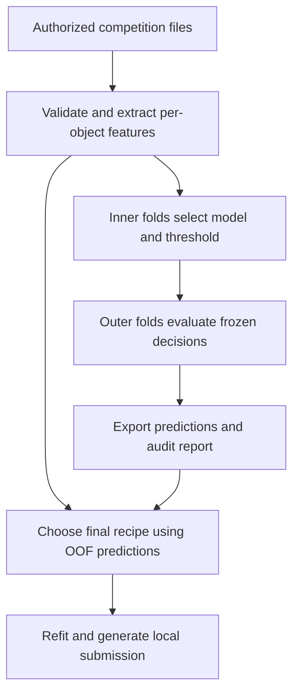

# MALLORN TDE Classifier

**Machine learning for finding rare tidal disruption events in irregular, six-band astronomical light curves.**

A reproducible Python pipeline inspired by the published second- and third-place MALLORN solutions: domain-informed light-curve features, gradient-boosted trees, and F1 threshold selection. The default compares basic and full LightGBM feature sets under nested validation. An optional hybrid backend adds CatBoost and a fixed blend.

> **Measured on the official dataset: nested local F1 0.5254.**
> Trained and evaluated on 3,043 labelled objects, with 148 TDEs. Generated and verified predictions for 7,135 test objects. This baseline was not submitted; the improved recipe has a separate Kaggle evaluation below.

| F1 | Precision | Recall | Validation |
| ---: | ---: | ---: | --- |
| **0.5254** | 0.4515 | 0.6284 | 5 outer × 3 inner folds; model and threshold chosen inside training folds |

[**Read the experiment results →**](reports/official_001/RESULTS.md)

> **Kaggle evaluation, 4 October 2026:** private F1 **0.6648**, public F1 **0.6825**, from one completed late submission. The private score is 0.0176 below the winner; no official placement is claimed. The improvement source and aggregate reports are included in this repository. [Read the verified result →](reports/kaggle_20261004/RESULTS.md)
>
> Local development F1 was **0.6912**; reserved-audit F1 was **0.5833**, with the recipe and threshold fixed before scoring. [Local audit →](reports/improvement_20261003/RESULTS.md)

[Methodology](docs/METHODOLOGY.md) · [Data setup](docs/DATA.md) · [Leading-solution references](docs/SOURCES.md) · [Verification status](reports/STATUS.md)

The next candidate passed its fixed local comparison: repeated-validation F1 **0.6841**, versus **0.6707** for the reference recipe. Its threshold is frozen; final refitting is blocked by the current runtime's CatBoost process-statistics access. It has **no Kaggle score yet**. [Second-cycle results](reports/cycle2_20261004/RESULTS.md).

Further local research completed **50 additional fold fits**. The highest
development F1 was **0.7030**, and five-class supervision reached **0.7131 average
precision**. The new candidates failed the full stability rule, so they have
not replaced the selected recipe. [Results](reports/cycle4_20261004/RESULTS.md) ·
[Checkpointed continuation](docs/RESUME_RESEARCH.md). Code publication was authorized on 5 October 2026.

**Kaggle notebook:** [Saved version 2](https://www.kaggle.com/code/ehsan1993/mallorn-reproducible-tde-research?scriptVersionId=355572876) (private in the owner account; synthetic check completed successfully in 66.4 seconds). [Self-contained source notebook](notebooks/mallorn_research.ipynb), including a synthetic software check and opt-in official training. [Publication checkpoint](docs/PUBLICATION_CHECKPOINT.md).

**Cycle-5 rebuild completed, 8 October 2026:** all 20 fold checkpoints were rebuilt (60 final LightGBM models), with exact saved-prediction replay. All five recipes match the historical F1/AP/repeat metrics to six decimal places. The acceptance gates retained the reference recipe. [Rebuild results](reports/CYCLE5_REBUILD_RESULTS.md). The lost original files were not recovered byte-for-byte. [Recovery details](reports/RECOVERY_20261005.md) · [Recovered method](docs/FIFTH_CYCLE_RECOVERY.md).

## What this project demonstrates

| Research skill | Implementation |
| --- | --- |
| Irregular time series | Per-band statistics, detection duration, seasonal gaps and weighted Lomb–Scargle features |
| Domain-informed features | Approximate dust correction, rest-frame timing, common-phase colours and descriptive post-peak decline |
| Rare-event modelling | LightGBM, simple baselines and F1 threshold selection; optional CatBoost blend |
| Reliable evaluation | Inner folds choose model and threshold; outer folds estimate the complete selection workflow |
| Reproducibility | File hashes, fixed seeds, pinned core packages, per-object predictions and fold audits |
| Inference | Saved model, exact feature-schema checks and a validated binary submission file |

## Approach and boundaries

The [second-place write-up](https://www.kaggle.com/competitions/mallorn-astronomical-classification-challenge/writeups/mallorn-2nd-place-solution) informed the emphasis on shape, phase bins, colours and boosting ensembles. The [third-place write-up](https://www.kaggle.com/competitions/mallorn-astronomical-classification-challenge/writeups/3rd-place-write-up-catboost-with-threshold-tuning) supports physics-informed features, CatBoost and threshold tuning.

This is an independent implementation of a subset of those ideas. The [improvement workflow](docs/IMPROVEMENT_METHODS.md) adds two-dimensional Gaussian processes, approximate blackbody features, flare fits, class-aware supervision and training-fold feature selection. Pretrained neural networks, SALT2 and echo-state networks remain unimplemented. [Sources and differences](docs/SOURCES.md) distinguish this work from the leading systems.



## Run locally

Use Python **3.11+** in a virtual environment. The implementation was tested with Python 3.12. A CPU is sufficient; no paid service is required by the code.

```bash
python -m venv .venv
# Linux/macOS:
source .venv/bin/activate
# Windows PowerShell instead:
# .venv\Scripts\Activate.ps1
python -m pip install -e .
python -m unittest discover -s tests -v
```

After accepting Kaggle's rules and extracting the official files into `data/mallorn/`:

```bash
mallorn run --data data/mallorn --output artifacts/run_001
```

The default run performs five outer folds, three inner folds and 500 boosting iterations per model. Use a new output directory for each experiment. Full options and the expected file layout are in [Data setup](docs/DATA.md).

`--backend hybrid` adds CatBoost and its equal-weight blend with LightGBM. Native CatBoost fitting and the optional hybrid test are now verified locally. Some restricted runtimes hide the process-statistics file required by CatBoost; training needs a compatible execution environment.

To check the software without competition data:

```bash
mallorn smoke --output artifacts/synthetic_smoke
```

The smoke run generates explicitly invented curves in a temporary directory. Its report is prominently marked **not competition performance**, and its output is named `synthetic_submission.csv`.

## Outputs from a data run

| File inside your run directory | Purpose |
| --- | --- |
| `RESULTS.md`, `figures/validation.svg` | Nested-validation results and plots |
| `metrics.json`, `oof.csv` | Exact scores, held-out probabilities and decisions |
| `fold_audit.json` | Every fitting, tuning and test object ID |
| `manifest.json`, `features.csv` | Input hashes, environment details in metrics, and feature matrix |
| `model.joblib` | Locally fitted deployment model |
| `submission.csv` | Binary decisions in sample-submission order; never uploaded automatically |

The primary score is the **outer nested F1**. The threshold selected from all out-of-fold predictions for the final model is a deployment tuning step; its best tuning F1 is not an unbiased performance estimate. Even valid local F1 cannot establish that this model beats a private Kaggle leaderboard score.

## Remaining limitations

- MALLORN curves are simulated from real source observations. Related simulations may cross object-level folds unless genuine source-template groups are supplied with `--groups`.
- Training redshifts are spectroscopic; test redshifts are photometric. `Z_err` is excluded, but the remaining measurement shift still needs evaluation.
- Dust correction uses representative wavelengths, and colours use bounded linear interpolation. Both are approximations; sparse or unreliable colours remain missing.
- This classifies full light curves. It is not an early-alert classifier or a deployed astronomical discovery system.

## Attribution and license

Created with **OpenAI Codex assistance for Ehsan Cheraghi**. The package is independently written, with methodology references credited in [SOURCES.md](docs/SOURCES.md). It is a portfolio research project, not a claim of prize eligibility or official competition placement.

Code: [MIT](LICENSE). Competition data remain subject to [Kaggle's competition rules](https://www.kaggle.com/competitions/mallorn-astronomical-classification-challenge/rules); they, trained models and per-object outputs are excluded from this repository. Only aggregate experiment evidence and hashes are published; raw observations, per-object features and predictions remain outside the public repository.
