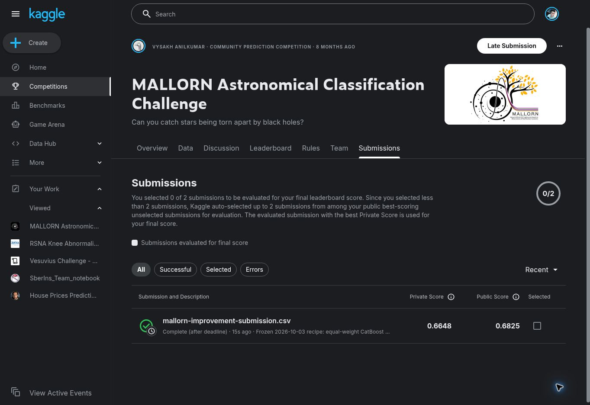

# Kaggle evaluation — 4 October 2026

**Kaggle accepted and scored the frozen candidate: private F1 0.6648,
public F1 0.6825.** Its status is **Complete (after deadline)** under Ehsan.Ch.
The user explicitly authorized this submission. No new GitHub publication occurred.

| Final private-score benchmark | F1 | Gap above this candidate |
| --- | ---: | ---: |
| John Titor, first | 0.6824 | 0.0176 (1.76 percentage points) |
| Suxing's Astronomer, second | 0.6762 | 0.0114 (1.14 percentage points) |
| Sigrid Nissen, third | 0.6758 | 0.0110 (1.10 percentage points) |
| This candidate, late submission | **0.6648** | — |

Leader scores were verified against the official final leaderboard on 3 October
2026. This late submission does not change the historical standings. The public
score 0.6825 must not be compared with competitors' private scores as evidence
of beating them. The ~0.68 private-score target remains unmet.

## Frozen experiment

The submitted file contains 7,135 objects and 406 positive predictions. It is
the unchanged recipe developed on 3 October: equal-weight averaging of a
three-class physics-only CatBoost model and a binary CatBoost model using
125 training-selected features, threshold 0.3228571055799115. Both components
were refitted on all 3,043 labeled objects before this first organizer-scored
evaluation. No threshold, feature or model was adjusted after viewing this score.

Development tuning F1 was 0.6912; the reserved audit F1 was 0.5833. These local
numbers use different data and validation procedures from Kaggle's scores.
See the [local audit](../improvement_20261003/RESULTS.md).

## Evidence

- [Kaggle submissions page](https://www.kaggle.com/competitions/mallorn-astronomical-classification-challenge/submissions), viewed while signed in.
- [Submission receipt and file hash](submission_receipt.json).
- [Scoring confirmation](submission-confirmation.jpg).

