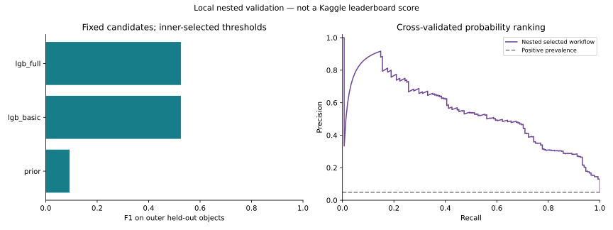

# First official-data experiment

**Nested local F1: 0.5254.** Precision 0.4515; recall 0.6284. This is an object-level cross-validation result, not a Kaggle leaderboard score.

Run completed 2026-10-01T04:55:21.975375+00:00. The supplied official archive contains **3,043 training objects (148 TDEs; 4.86%)** and **7,135 unlabelled test objects**. The fixed protocol used five outer folds, three inner folds, 500 iterations, seed 42 and the LightGBM backend. No score-based model revisions were made during this experiment.

## Measured performance

| Workflow | Outer F1 | Precision | Recall | Average precision |
| --- | ---: | ---: | ---: | ---: |
| Nested selected workflow | 0.5254 | 0.4515 | 0.6284 | 0.5440 |
| prior | 0.0928 | 0.0486 | 1.0000 | 0.0483 |
| lgb_basic | 0.5254 | 0.4706 | 0.5946 | 0.4563 |
| lgb_full | 0.5254 | 0.4515 | 0.6284 | 0.5440 |
| all_negative | 0.0000 | 0.0000 | 0.0000 | 0.0486 |
| all_positive | 0.0928 | 0.0486 | 1.0000 | 0.0486 |

Pooled confusion counts **TN / FP / FN / TP = [2782, 113, 55, 93]**. Conditional 95% bootstrap interval for F1: **0.4639–0.5892**. This resamples fixed OOF decisions; it excludes retraining, source-template dependence and protocol-selection uncertainty.



| Outer fold | Selected candidate | Held-out F1 | Held-out TDEs |
| --- | --- | ---: | ---: |
| 1 | lgb_full | 0.5000 | 30 |
| 2 | lgb_full | 0.5060 | 30 |
| 3 | lgb_full | 0.5263 | 30 |
| 4 | lgb_full | 0.5641 | 29 |
| 5 | lgb_full | 0.5294 | 29 |

The full feature set improved average precision from **0.4563 to 0.5440**, but basic and full models both rounded to **0.5254 F1**. This run establishes no material F1 gain from the added feature families. All five inner selection steps chose `lgb_full`.

## Data handling and diagnostic findings

- Dropped 891 train and 2,022 test observations with missing flux; retained every object and 1,621,596 measured observations. About 37.70% of retained flux values are negative and remain valid inputs.
- Floored one negative test photometric redshift (-0.01751) to zero for feature calculations. Raw input files remain unchanged. Both data-contract changes preceded model evaluation.
- Engineered 414 features independently per object. Labels, SpecType, translated names, storage splits, object IDs and Z_err are excluded from classifier inputs.
- Feature missingness: 33.83% train and 33.78% test. Missing values are imputed using only each model fitting fold.
- No source-template mapping is included. Storage splits and random names are not assumed to identify independent source families.
- Z_err is missing for all train objects and present for all test objects. Similar train/test median Z (0.4818 / 0.4842) does not remove the measurement-quality shift.

Post-evaluation errors by broad class (SpecType is used only for this diagnostic):

| Class | Objects | Classified as TDE | Missed TDEs |
| --- | ---: | ---: | ---: |
| AGN | 1786 | 47 | 0 |
| Other transient | 1109 | 66 | 0 |
| TDE | 148 | 93 | 55 |

## Final local model and submission

The full-OOF deployment selection chose **lgb_full**, threshold **0.05066201**. Its optimized OOF F1 (0.5650) is a tuning statistic, not the primary performance estimate. The chosen model was refitted on all 3,043 training objects.

The generated submission contains all 7,135 test objects in official sample order, with **496 positive predictions**. Input hashes, fold partitions, OOF labels/F1 and saved-model replay passed the independent audit. **Nothing was submitted to Kaggle.**

## Reproduce and audit

```bash
mallorn run --data data/mallorn --output artifacts/official_001 --outer-folds 5 --inner-folds 3 --iterations 500 --seed 42 --threads 2 --backend lightgbm
python scripts/verify_run.py --data data/mallorn --run artifacts/official_001
```

Aggregate evidence: [metrics](metrics.json), [fold summaries](fold_summary.json), [data audit](data_audit.json), [feature audit](feature_audit.json), [error analysis](error_analysis.json), [input/feature hashes](manifest.json), [verification](verification.json). The complete local output also contains OOF IDs, fold memberships, features, model and submission; these stay outside the public repository.

## Interpretation

This establishes a working, measured boosted-tree baseline inspired by selected ideas from leading solutions. It does not reproduce their neural pretraining, Gaussian processes, physical fits or extensive ensembles. Local folds may share original simulation sources; the test redshift quality differs; threshold transfer to a full refit remains uncertain. There is no organizer test score, so improvement over the top performers has not been demonstrated. Further experiments should be recorded separately, including negative results.
